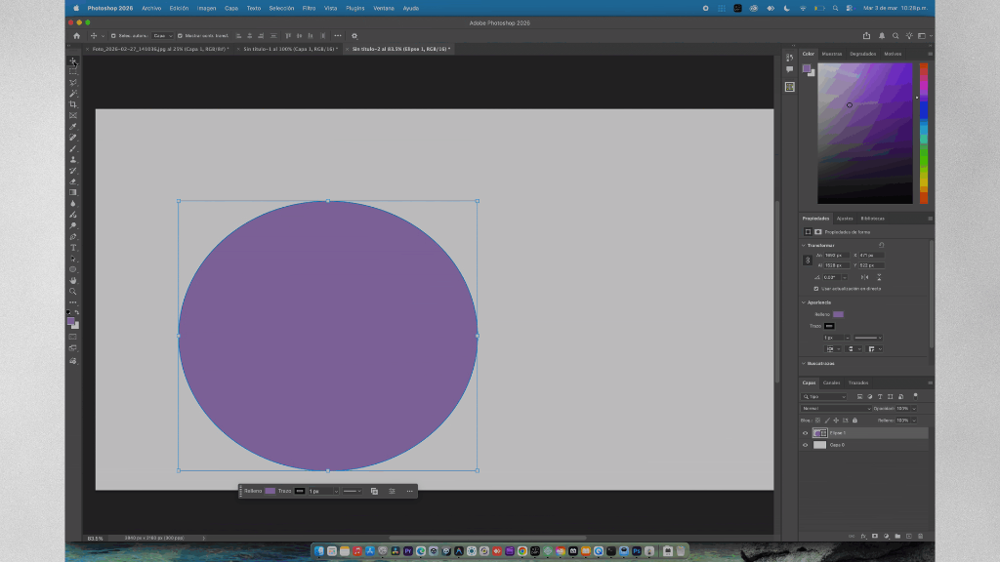

# Photoshop Resize to Canvas or Document Size (Plugin UXP para Photoshop)

  

¡Un panel UXP para Adobe Photoshop completamente localizado y diseñado para reformatear y exportar sin problemas capas de píxeles, grupos, capas de texto y vectores al hacer coincidir de manera inteligente su tamaño de forma nativa con el lienzo de tu documento con un solo clic!

## Características
* **Ajustar al Lienzo:** Redimensiona la capa para que encaje elegantemente por completo dentro de los límites del documento.
* **Rellenar:** Escala la capa perfectamente de borde a borde ignorando la proporción estándar, actuando como un recorte de relleno.
* **Auto Rotar Imagen:** Una opción que activa la rotación nativa de la capa en 90° si su orientación de formato (Vertical -> Horizontal) entra en conflicto con la orientación del lienzo antes de escalar.
* **Enviar a Nuevo Documento:** Duplica la capa actual y la exporta directamente a un nuevo documento con múltiples ajustes preestablecidos `(720p, 1080p, 4K)` y la opción de definir un tamaño personalizado.
* **Exportación Rápida a PNG:** Atajos de un solo clic para exportar rápidamente la capa activa o el documento completo como un PNG con fondo transparente.
* **Auto-Conversión a Objeto Inteligente:** Convierte automáticamente Textos, Formas y Grupos en Objetos Inteligentes antes de cambiar el tamaño para conservar el 100% de la calidad original de los píxeles sin causar errores.

  

## Uso
Da doble click  sobre el archivo ccx descargado, acepta los mensajes de advertencia.

Abre photoshop y en el menú Plugins > Resize2Canvas da click sobre el nombre para abrir el panel.
