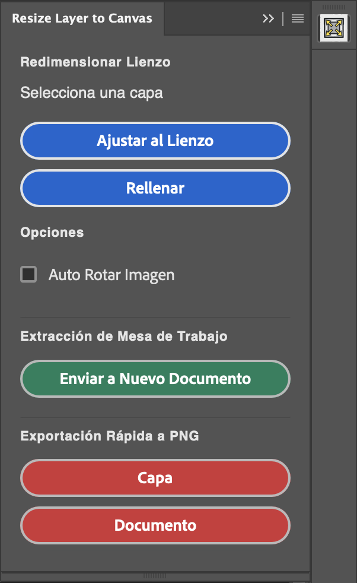

# Photoshop Resize to Canvas (UXP Photoshop Plugin)

  

A fully localized Adobe Photoshop UXP panel designed to seamlessly reformat and export pixel layers, groups, text layers, and vectors by intelligently matching them natively to your Document's canvas footprint in one click!

## Features
* **Fit (No Crop):** Resizes the layer to gracefully fit entirely inside the document bounds constraints.
* **Fill (Crop):** Scales the layer perfectly edge-to-edge ignoring standard aspect borders, acting as a fill crop. 
* **Auto-Rotate:** An option that triggers the layer to rotate by 90° natively if its AspectRatio formatting orientation (Portrait -> Landscape) conflicts with the canvas orientation prior to scaling.
* **Send to New Document:** Duplicates the current layer out and exports it straight to a fresh artboard with multiple predefined streaming presets `(720p, 1080p, 4k)` and variable Custom Size injection.
* **Quick Exports:** One-click shortcuts to rapidly export the active layer or doc as a transparent PNG.
* **Smart Object Auto-Conversion:** Automatically converts Text, Shapes, and Groups into Smart Objects before scaling to preserve 100% of their original pixel quality without throwing errors.

## Usage
Add to Photoshop using the UXP Developer Tool.
